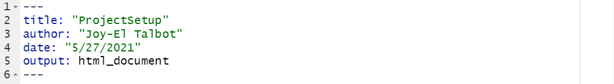
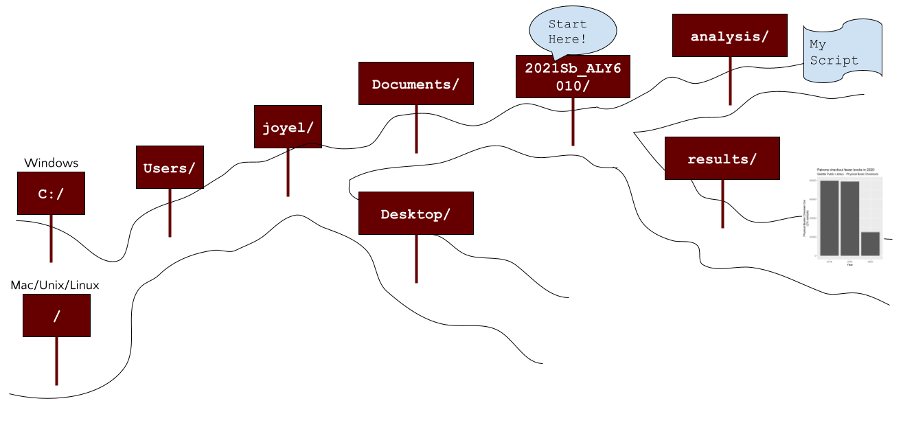
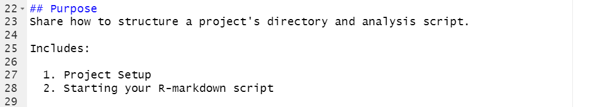

```{r setup, include=FALSE}
knitr::opts_chunk$set(echo = TRUE)

# R-markdown/Knitr alternative to setwd()
# MUST be run in this first chunk called "setup"
knitr::opts_knit$set(root.dir = "C:/Users/joyel/Documents/Roux/ALY6010/2021Sb_ALY6010/") # TODO change to your project directory

# suppress scientific notation
options(scipen = 99)

# suppress loading strings as factors
options(stringsAsFactors = FALSE)
```

## Purpose
Share how to structure a project's directory and analysis script.

Includes:
  
  1. Project Setup
  2. Starting your R-markdown script


## Project Setup

### Why R Markdown?
I'm using this R Markdown document to track my long-form notes (like this text), interspersed with my R code. I prefer this method for my exploratory analyses because it lets me keep my thoughts (or WHYs) next to my code (or HOWs). With an R Markdown, you have the option to "knit" it into an HTML or other type of output - these can make for nicer technical run-throughs (think sharing with your fellow analysts NOT presenting to stakeholders or bosses) but are not necessary. On the whole, this document is MOST concerned with making life easier for FUTURE-YOU when you have to return to the analysis 6 months down the road.

Resource: [Cheatsheet for R Markdown](https://www.rstudio.com/wp-content/uploads/2015/02/rmarkdown-cheatsheet.pdf)


### Setting up your project directory


#### To version control or not to version control
Many reasons to version control, but as a solo-analyst I tend to think of it as a way to have peace-of-mind by knowing my analysis is in the cloud in case my computer dies.

Not to version control - I'm not sure there is every a reason not to use version control. The closest might be the concern over trade-secrets, private information, or intellectual property being publically available. If these apply to you, then consult your company's IT team (they may have a PRIVATE git or similar set up). If you are going it alone (or using for personal reasons) then you might look into a private account on GitHub or BitBucket (or similar). 

I'll be storing this work in my github and you can view: [https://github.com/Joy-El/2021Sb_ALY6010](https://github.com/Joy-El/2021Sb_ALY6010)


#### Build file structure
Technically this can be done via your operating system's file browser or via the command line/terminal system. Here, I'll show you how to create folders directly within R via the `dir.create()` base command.

I like to separate my projects into a few key folders.

  + `data/`
    + Holds all of the raw data and sometimes intermediate data
    + Raw data + scripts in the project together should be able to create all intermediate data and result files
  + `src/`
    + `src` is short for "source"
    + Holds scripts that can be "run" without changes
    + Helper functions, analysis pipeline (without input variables)
    + Scripts that don't change from one run to the next
  + `analysis/`
    + Holds scripts that change from one run to the next
    + "Lab Notebook" of my analysis
  + `results/`
    + Holds outputs of analysis/ scripts (and sometimes from src/ scripts)
    + Includes sub-directories for each analysis "run"
      + `[date]-[analysis]-results/`
        + Example: `2021-05-23-distributionplots-results/`
        + May have sub-directories for 
          + `tables/`
          + `graphs/`
          + `logs/`
            + Basically an output of any key details (initial variable assignments), and errors/warnings from running the script(s). Could also be a single file instead of a folder.
  
```{r createProjectDirectory}
dir.create("data/")
dir.create("src/")
dir.create("analysis/")
dir.create("results/")
# we will create sub-directories within results/ during our analysis
```


#### Moving files
Now that our data/ directory is made, let's move our input data into that folder.

```{r moveDataFile}
# because I set my working directory to 2021Sb_ALY6010, I'm making paths relative to that starting spot
file.copy(from = "resources/sampled_dailyCheckouts.csv",
          to = "data/")
file.copy(from = "resources/LungCapDataCSV.csv",
          to = "data/")
```


## Starting your R-markdown script
Here I outline the key components that I strive to have at the top of my R-markdown scripts. 


### Script header


  + Provides meta-data for your script.
  + I try to match title to the name of the file (more or less).
  + NOT in an R-chunk; update title/author/date as desired.


### Setup R-chunk
```{r setup_example, eval=FALSE}
knitr::opts_chunk$set(echo = TRUE)

# R-markdown/Knitr alternative to setwd()
# MUST be run in this first chunk called "setup"
knitr::opts_knit$set(root.dir = "C:/Users/joyel/Documents/Roux/ALY6010/2021Sb_ALY6010/") # TODO change to your project directory

# suppress scientific notation
options(scipen = 99)

# suppress loading strings as factors
options(stringsAsFactors = FALSE)

# set a default seed for the (pseudo-)random number generation
# important if you want the same results on re-runs
# changing the number will give you a different result
set.seed(889)
```

  + MUST be first chunk and MUST be named "setup"
  + Typically set to `include=FALSE` so that you don't see it in the HTML
    + I set this version to default include (TRUE) and `eval=FALSE` so that you can see it but it doesn't run (`eval`uate)
  + Where you set options for knitr about how the R-markdown is converted to HTML

#### Setting your working directory or root.dir
It is the "Start Here" label on a trail. It provides a short-cut so you can refer to locations without starting from the beginning.



  + To set a working (or root) directory include this line:
    + `knitr::opts_knit$set(root.dir = "path to working dir")`
    + Note path starts from your BASE directory
      + `"C:/Users/"` for Windows
      + `"/Users/"` for Mac or Linux
      
#### Also set other default settings

  + `scipen` - sets number of digits numeric value can get to before converting to scientific notation. Setting this large will prevent R from converting numeric IDs into scientific notation.
  + `stringsAsFactors` - sets whether strings in data imports are converted to factors. I prefer to set this to false as it removes errors/warnings when I later subset data to exclude certain category values. You can also set this in the `read.csv()` command.


### Introduce focus, purpose, or goal of analysis


  + Usually 1-2 sentences that provide the overarching focus of the .Rmd analysis file.
  + May include (at start or afterwards) highlevel topics (typically header lines from later in the script)


### Load libaries needed
```{r libraries_example}
library(ggplot2)
library(tidyr)
library(dplyr)
```

  + All library() calls to load additional packages.


### Define constants
```{r constants_example}
# input source
DATADIR <- "data/"

# build results directory
ANALYSISNAME <- "name_of_analysis"  # NO spaces!
DATESTAMP <- format(Sys.time(), "%Y-%m-%d")
# DATESTAMP <- format(Sys.time(), "%Y-%m-%d-%H%M%S") # includes hours, minutes, and seconds if running multiple times in a day
RESULTSDIR <- paste0("results/",DATESTAMP,"-",ANALYSISNAME,"-results/")
dir.create(RESULTSDIR)
GRAPHDIR <- paste0(RESULTSDIR, "graphs/")
dir.create(GRAPHDIR)
TABLEDIR <- paste0(RESULTSDIR, "tables/")
dir.create(TABLEDIR)

# define default plot size
PLOT_WIDTH <- 5
PLOT_HEIGHT <- 5
PLOT_UNITS <- "in"
PLOT_RES <- 96 # required for png() device when units aren't "px"
```

  + Constants that you use to input or output data
    + Here I define the results directory for this analysis to have the format of: `YYYY-MM-DD-analysisname-results/`
  + May also have other constants or "settings" that you need for your analysis.
  + Names of constants (unlike names of variables) tend to be written in ALL CAPS as a short-hand to say that they do not change within the script. They may have different values from one script run to the next. 
  + The value of the constants should be somehow recorded within the `RESULTSDIR` so that you have a record of your analysis run. (We will look into this next week.)


### Load data
```{r loadData_example}
checkouts <- read.csv(paste0(DATADIR,"sampled_dailyCheckouts.csv"),
                      stringsAsFactors = FALSE)
head(checkouts)

# Other large dataset (Checkouts By Month) loaded later in the loadData_checkoutsByMonth chunk
```

  + I like to keep the loading of data to a single (near the top) area. 
  + If files are very big, you may need to load some of them only at certain points. In such cases, I'd 1) label the other data loading chunks as `loadData_` plus a descriptor (eg. `loadData_checkoutsByMonth`) and 2) reference that other loadData chunk in a comment in this primary one.
  
  
### Analyze, clean, process data
> chunks/examples not shown

  + These are the majority of your script
  + Keep 1 R-chunk for 1-purpose!
  + If you find yourself copy&pasting chunks, you may consider writing a function instead.
  
  
### Output Tables
```{r outputTables}
byYear <- checkouts %>%
  group_by(CheckoutYear) %>%
  summarise(Count = n())
print(byYear)

write.csv(byYear,
          file = paste0(TABLEDIR,"Checkouts_by_year.csv"),
          row.names = FALSE) # to suppress row.names of 1, 2, 3...
```

  + `write.csv` ensures formatting of output matches CSV file standards
  + `write.table` gives more flexiblity but usually not needed
  + Other commands for writing JSON, XML, and other formats can be found with a quick search (and usually a library() package).


### Output Graph Images
#### With ggplot2
```{r outputGraphs_ggplot}
# wrap in parentheses so the "+" signs are a the left, making it easier to comment out lines
(ggplot(checkouts)
+ aes(x = factor(CheckoutYear))  # adding factor() so these names become x-axis label names
+ geom_bar()
+ ggtitle("Patrons checkout fewer books in 2020")
+ labs(subtitle = "Seattle Public Library - Physical Book Checkouts")
+ scale_y_continuous("Physical Books Checked Out\n(2% sample)")
#+ scale_x_discrete("") # no label
+ scale_x_discrete("Year")
)

# saves the last image you plotted to file by default
# OTHERWISE you can pass a ggplot object to the plot= argument
ggsave(filename = paste0(GRAPHDIR,"ggplot_CheckoutsByYear.png"),
       width = PLOT_WIDTH*0.9, # add multipliers to make image a little bigger or smaller as needed (if needed)
       height = PLOT_HEIGHT*1.1,
       units = PLOT_UNITS)
```

  + Graph first, then save after (similar to table output workflow)
  + `ggsave()` will write the last plot to file
  + Setting constants for plot size makes it easy to keep images of consistent size
  + Nudge size larger or smaller with a size multiplier to the PLOT_WIDTH or PLOT_HEIGHT constants


#### With base R plots
```{r outputGraphs_basePlot}
# open output file
png(filename = paste0(GRAPHDIR,"basePlot_CheckoutsByYear.png"),
    width = PLOT_WIDTH,
    height = PLOT_HEIGHT,
    units = PLOT_UNITS,
    res = PLOT_RES)

# create plot
hist(x = checkouts$CheckoutYear,
     main = "Patrons checkout fewer books in 2020",
     sub = "Seattle Public Library - Physical Book Checkouts",
     xlab = "Year",
     ylab = "Physical Books Checked Out\n(2% sample)")
      
# close the output device
dev.off()
```

  + Sandwich file-saving code around the graph-building code
  + If your graph building errors out, you may leave "devices" open 
    + Avoid by testing graph code first (without opening a device)
    + Fix by repeatedly run dev.off() in the console

  
#### Resources/Further Reading:

  + [Comparing ggplot2 and R Base Graphics](https://flowingdata.com/2016/03/22/comparing-ggplot2-and-r-base-graphics/)
  + [What I learned recreating 29 Storytelling with Data charts in R](https://www.noisetosignal.io/2020/07/recreating-the-charts-in-storytelling-with-data-with-r/)
    + [Adam Ribaudo's GitHub](https://github.com/adamribaudo/storytelling-with-data-ggplot)


