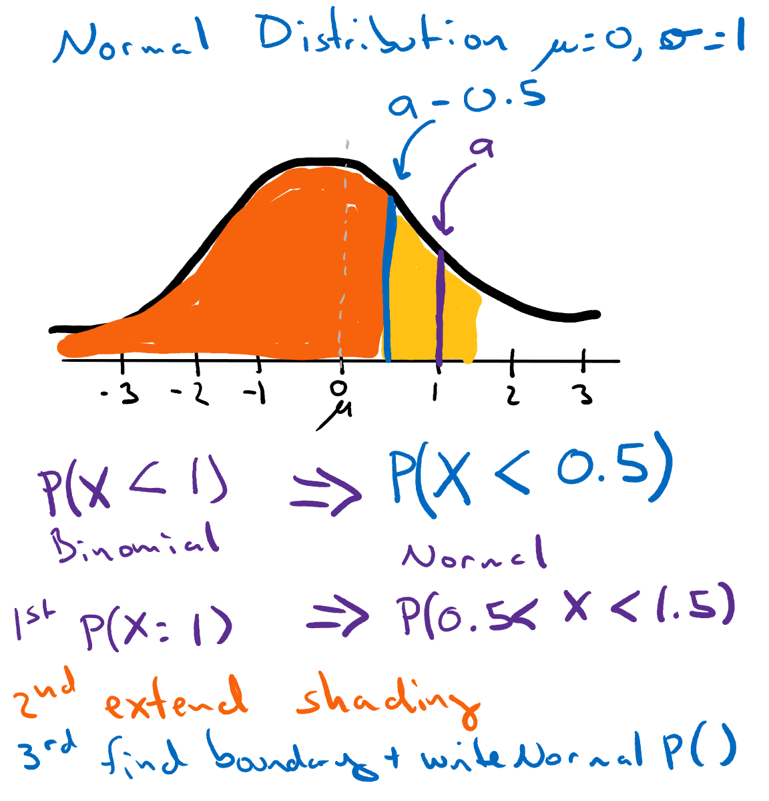

```{r setup, include=FALSE}
knitr::opts_chunk$set(echo = TRUE)

# R-markdown/Knitr alternative to setwd()
# MUST be run in this first chunk called "setup"
knitr::opts_knit$set(root.dir = "C:/Users/joyel/Documents/Roux/ALY6010/2021Sb_ALY6010/") # TODO change to your project directory

# suppress scientific notation
options(scipen = 99)

# suppress loading strings as factors
options(stringsAsFactors = FALSE)
```

## Purpose
Summarize key topics from Saturday's Office Hours. Items include:

  1. Visualization of Bluman Table 6-2 corrections for Normal approximation of binomial distribution
  2. What is a pipe '%>%'?
  3. Example of using multiple rounds of grouping.
    3a. Includes how to split 'MM-DD-YYYY HH:MM:SS' timestamp into day only
  4. Example of wrapping a ggplot() command in a function.


```{r libraries}
library(ggplot2)
library(dplyr)
library(datasets)  # to get us some data to use in the examples
library(purrr) # part of tidyverse to get access to the map() function
```

```{r constants}

```

```{r loadData}
iris <- datasets::iris 
# technically iris lazy-loads when I called "library(datasets)" above and then later use "iris", but adding so that you can see where the data comes from

rain <- read.csv(file = 'data/rainFallNOAA.csv') # rain fall for Portland ME from 2000 to 2014 via the National Centers for Environmental Information (NCEI) group of the National Oceanic and Atmospheric Administration https://www.ncdc.noaa.gov/cdo-web/search
```

### 1. Visualization of Bluman Table 6-2 corrections for Normal approximation of binomial distribution

Table 6-2 on Bluman pg 355  (or 6-45) shows how you adjust the probability formula when using the Normal approximation of a Binomial Distribution. 

We have to do this for two reasons: 

  1. because Binomial distributions are discrete (only care about integer values), while the Normal distribution is continuous
  2. because the area under the Normal distribution for a single value (eg P(*X* = 0) is always zero - that's why we ask for ranges

#### When finding P(*X* = *a*) use P(*a* - 0.05 < *X* < *a* + 0.5)
Basically the straight conversion of expanding the integer value *a* to include all decimal values around it. 

We can convert Binomal P(*X* = 1) to Normal approximation by *expanding* the purple line by 0.5 in each direction (See Example 1), resulting in P(0.5 < *X* < 1.5).


#### When looking for inclusive ranges

  + P(*X* >= *a*) becomes P(*X* > *a* - 0.5)
  + P(*X* <= *a*) becomes P(*X* < *a* + 0.5) 
  
_But WHY?_

Think of it in two steps: 

  1. First, the equality bit or P(*X* = a)
  2. Then, the greater or less than bit 

Let's do an example: 
  
  + P(*X* >= 1)
  + First convert P(*X* = 1) ==> P(0.5 < *X* < 1.5)
  + Drawing that looks like our prior example 
  + Extend the shading to the right (for greater than) or to the left (for less than)
  + Find the boundary of the shading, finding that we want P(*X* > 0.5)


For the reverse P(*X* <= 1) it would look like this:


#### When looking for exclusive ranges
  
  + P(*X* > *a*) becomes P(*X* > *a* + 0.5)
  + P(*X* < *a*) becomes P(*X* < *a* - 0.5) 

We swap adding or subtracting the 0.5 compared to the inclusive versions because we now want to exclude the "yellow" shading that represents the number itself. 

Again here is an example for each. 




#### Wrapping up
Overall, rather than memorizing the formulas in Table 6-2, I hope you can now feel comfortable to apply the logic and drawings to make these conversions yourself. Remember, the core is about extending the area for a single integer +/- 0.5, then the rest is about deciding where to "draw the blue line" which becomes your value in the Normal approximation conversion.

### 2. What is a pipe `%>%`?

That symbol, referred to as a 'pipe' is a special function in the `dplyr` package. It tells R to take the output of the object on the left and 'pipe' it as input into the object on the right. 

The goal of the pipe is to improve readability in code by avoiding nesting various `dplyr` or `tidyverse` functions. You can learn more about it and the best practices for how to use it in your code [here in the Tidyverse Style Guide](https://style.tidyverse.org/pipes.html). 
Here's an example, using the Iris dataset, first though we'll layout our Wants, Haves, and Process (a handy way to plan out a coding piece).

Want: for sepal length of each species, calculate the 

  + average
  + median
  + standard deviation
  
Have: iris dataset including

  + Sepal.Length field provides lengths
  + Species field provides species names

Process:

  + Group data by species
  + Summarize grouped data to calculate average, median, and standard deviation
  
```{r pipeExample}
# without pipes
df_nopipes <- summarize(group_by(iris, Species),
                        Average = mean(Sepal.Length),
                        Median = median(Sepal.Length),
                        StandardDeviation = sd(Sepal.Length))
head(df_nopipes)

df_pipes <- iris %>%
  group_by(Species) %>%
  summarize(Average = mean(Sepal.Length),
            Median = median(Sepal.Length),
            StandardDeviation = sd(Sepal.Length))
head(df_pipes)
```

As we learned in office hours today, `%>%` will provide the left-object's output to the FIRST parameter in the right-object (or function). This means that you can use it with your own functions. I'll show an example of these in the ggplot() wrapper below.

#### How much to pipe? 
Generally, I like to keep my piping to a single core task (eg getting a summary table). If I then want to plot the data, I'll do that as a separate set of commands (though technically you could pipe the data). This approach stems from the programming idea: 

> A function should do ONE thing.

> Functions get large (and confusing) when they try to do more than one thing.

### 3. Example of using multiple rounds of grouping.
When working with event frequency data, where a row in the data represents a single data point, it is important to summarize to a base frequency before you can really dig into the stats. This is because each row is effectively a frequency of 1. 

Here, I'll share some code around: 

  1. Turning a timestamp string into a day-based date
  2. Using summarize() and group_by() to get frequency per day (or daily rates)
  3. Using summarize() and group_by() to get average daily rate for a year

#### Average daily rainfall for each year
Want: 

  + Total rainfall by day; averaged for each year
  
Have: 

  + Hourly rainfall (field HPCP) with a Timestamp string "YYYYMMDD HH:MM" (field = DATE)
  
Process:

  + Split DATE string by white space " " 
  + Keep only first half containing the Date
  + Store as "DAY" field
  + Store first 4 characters of "DAY" as "YEAR" field
  + *We are skipping converting these into date objects as that isn't needed.*
  + Group data by DAY and sum HPCP values --> store as dailyRain
  + Group dailyRain by YEAR and average dailyRain values
  
```{r dateStringProcessing}
# based on example: https://rpubs.com/Mentors_Ubiqum/split_column
# strsplit(string, byvalue) returns a LIST of the split pieces
strsplit("Today is beautiful", " ") 

# To ONLY get "Today" from this we can use the map() function to get a list with only the first element 
strsplit("Today is beautiful", " ") %>%
  map(1)

# Finally using as.character() will change the one-element list into a single value
strsplit("Today is beautiful", " ") %>%
  map(1) %>%
  as.character()

# wrapping these together, we can apply them to our data.frame field
rain$DAY <- as.character(map(strsplit(rain$DATE, " "), 1))

# get Substring of DAY for the YEAR
rain$YEAR <- substr(rain$DAY, 0, 4)
head(rain)
```

```{r dailyRain}
dailyRain <- rain %>%
  group_by(DAY, YEAR) %>%  # bringing YEAR along for the ride
  summarize(dailyRain = sum(HPCP))
head(dailyRain)
```

```{r yearlyAverageDailyRain}
yearlyAverage <- dailyRain %>%
  group_by(YEAR) %>%
  summarise(averageDaily = mean(dailyRain),
            std_devDaily = sd(dailyRain))
yearlyAverage

# alternatively, we could have piped this all together - though it certainly becomes trickier to "read"
yearlyAverage_alt <- rain %>%
  group_by(DAY) %>%
  summarize(dailyRain = sum(HPCP),
            YEAR = max(YEAR)) %>% # I'm bringing YEAR 'along for the ride' in a different way here
  group_by(YEAR) %>%
  summarise(averageDaily = mean(dailyRain),
            std_devDaily = sd(dailyRain))
yearlyAverage_alt
```

### 4. Example of wrapping a ggplot() command in a function.
Here lets look at how we can create a custom function to make a type of plot over and over again. Generally my process is to: 

  1. Create a single ggplot() command to make the type of plot I want
  2. Wrap it in a function() call
  3. Customize function code to add flexibility through variables
  4. Test run with same data used in step 1
  5. Make LOTS of graphs!

```{r ggplotWrapperFunction}
# returning to the Iris data...
# 1. plot histogram of Sepal.Widths for a given species
(ggplot(iris[iris$Species == 'setosa',])
 + aes(x = Sepal.Width)
 + geom_histogram(bins = 30)
 + ggtitle("Setosa Sepal Widths")
 + scale_x_continuous("Sepal Width")
 + scale_y_continuous("Frequency")
 )

# 2. wrap in a function; I like to start these with "plot" because that is what the function does
plotSepalWidth <- function(df, species) { # df is often used as a generic variable name for data.frame
  p <- (ggplot(df) # 3. replacing "iris[iris$Species == 'setosa',]" with "df"
   + aes(x = Sepal.Width)
   + geom_histogram(bins = 30)
   + ggtitle(paste(species, "Sepal Widths")) # 3. customize title
   + scale_x_continuous("Sepal Width")
   + scale_y_continuous("Frequency")
   )
  return(p)
}

# 4. test run with existing data
plotSepalWidth(iris[iris$Species == 'setosa',], species = 'Setosa')

# 5. use loops to RUN lots
for (species in unique(iris$Species)) {
  iris %>%
    filter(Species == species) %>%
    plotSepalWidth(species) %>%
    print() # call to explicitly print ggplot (required in loops)
}

# EXTRA: because our function returns the ggplot object AND those are designed to be built upon, we can add more specifics to our plot after running the function.

# here I'm plotting all the data and coloring it by species
plotSepalWidth(iris, "All") + aes(fill = Species)

```